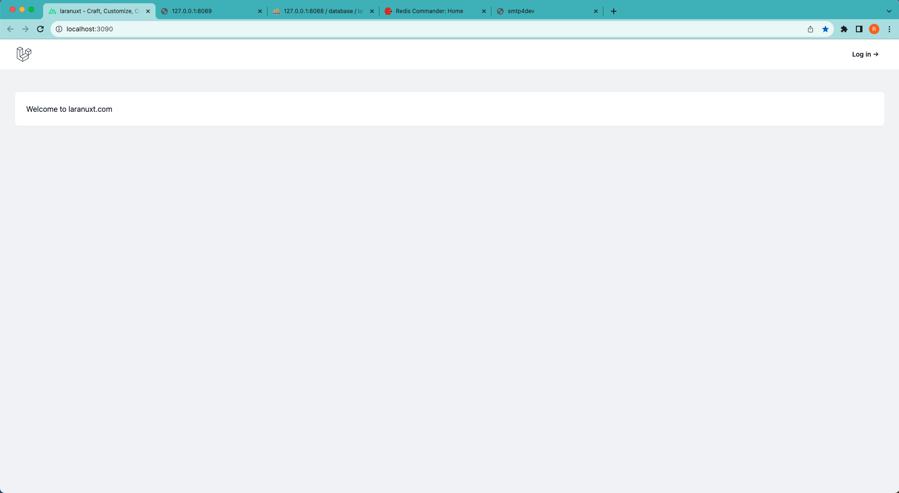
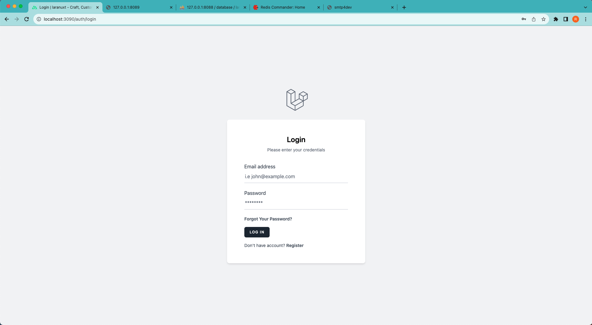
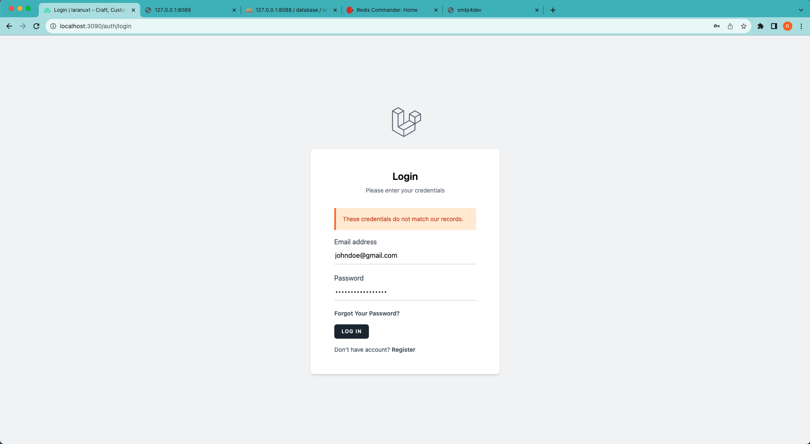
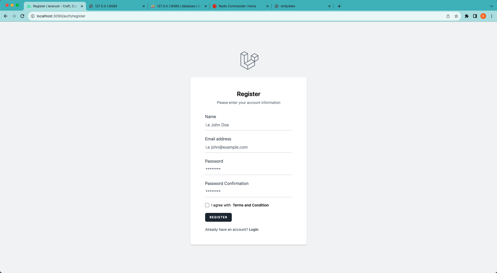
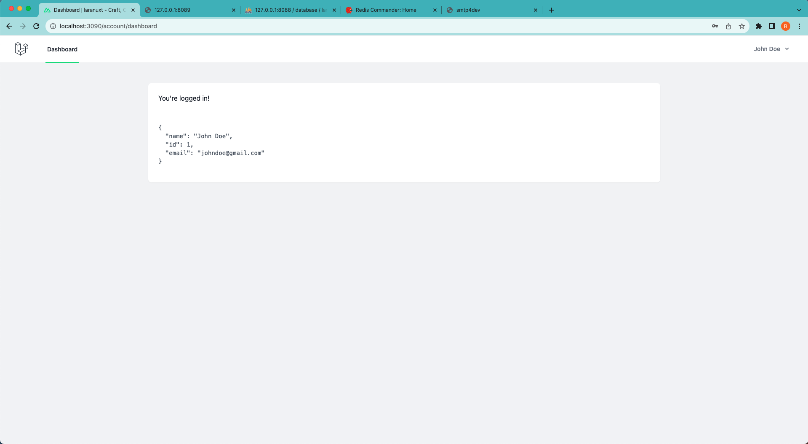
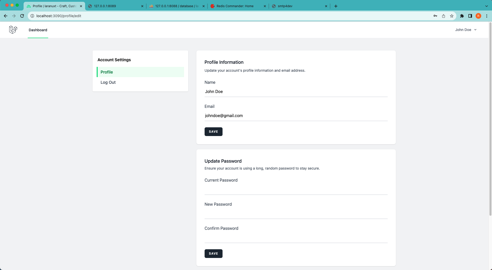
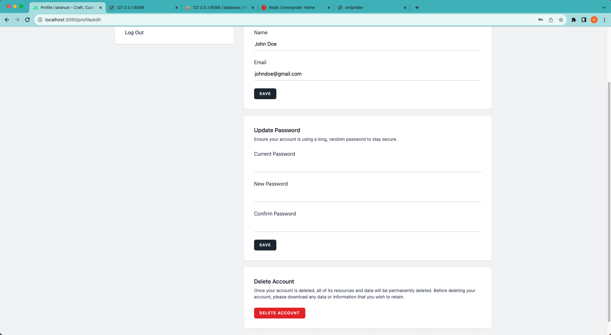

[Go Back](README.md)

## Screenshots
**Note:** You must have [Laranuxt Backend](https://github.com/phpfarmer/laranuxt-backend-docker-starter) application up and running with correct port setup to get it all working!

